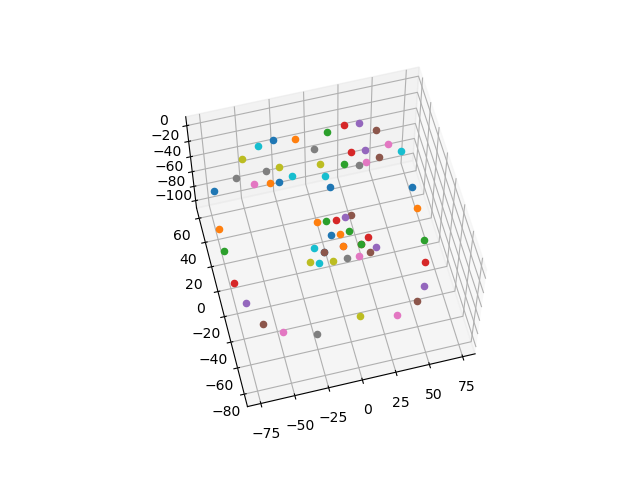

 ### Generate the 3D  sparse face shape corresponding to  iBug 68 landmark model .

The 3D shape are extracted from Surrey Face Model . You should compile eos library at first.
 (https://github.com/patrikhuber/eos)

